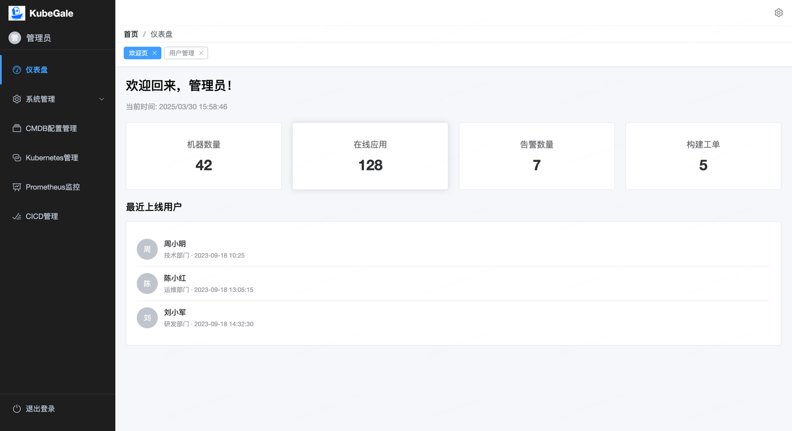
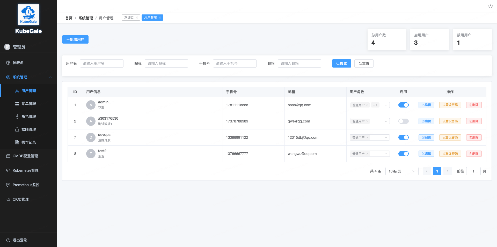
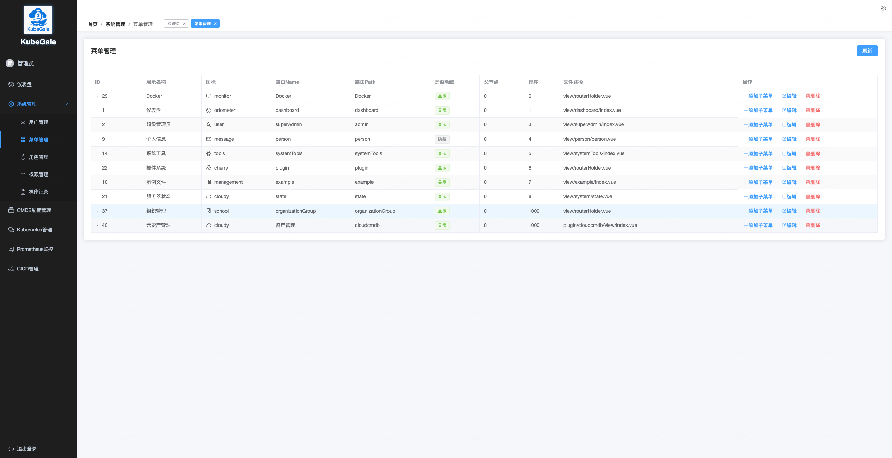
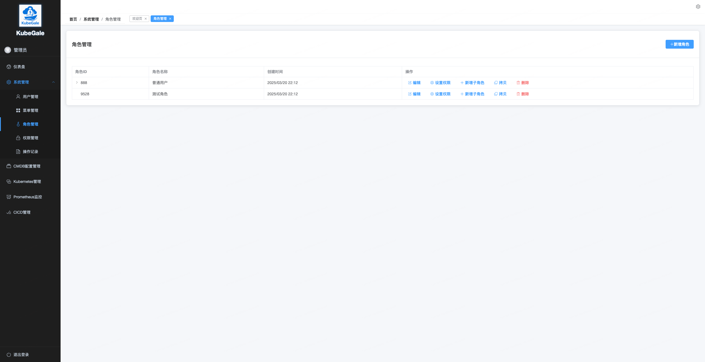
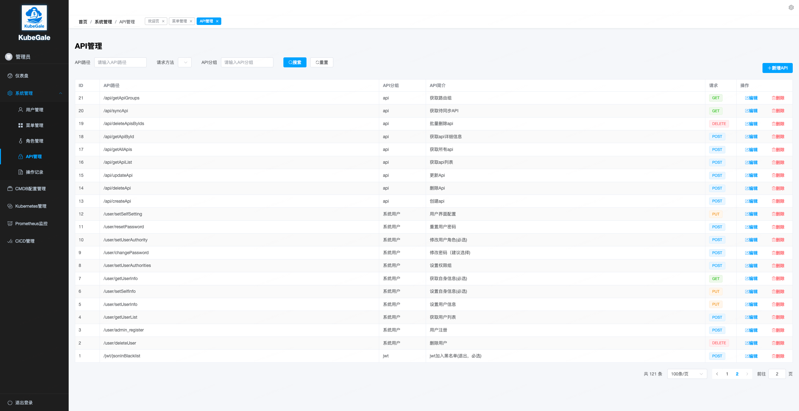
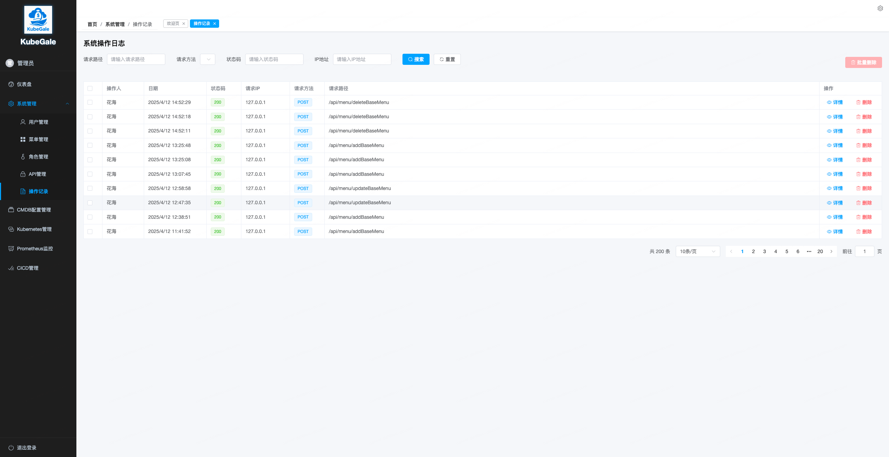
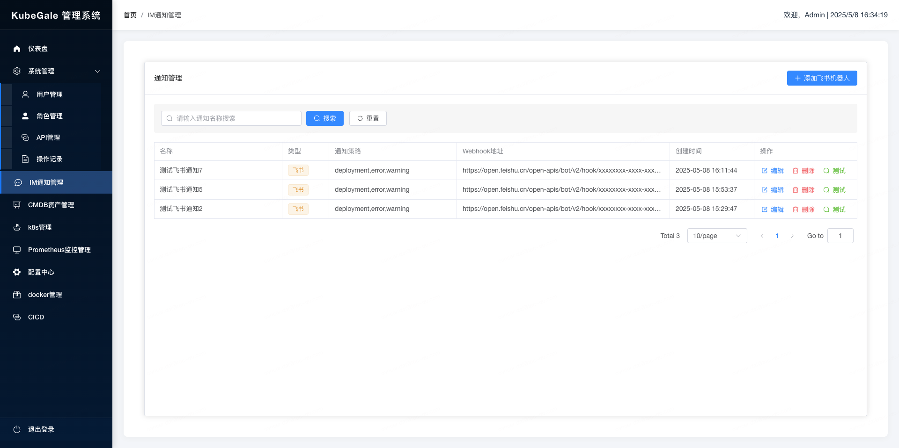
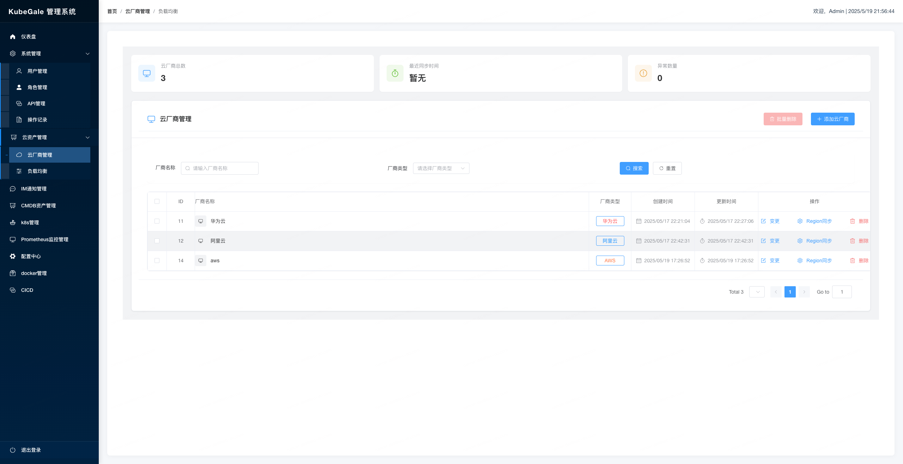
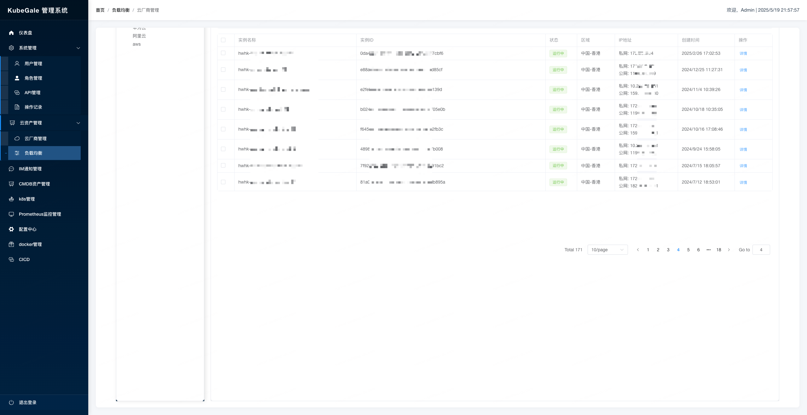

# KubeGale 前端项目

KubeGale 是一个现代化的 Kubernetes 管理平台，提供直观的用户界面，帮助用户轻松管理和监控 Kubernetes 集群。

## 技术栈

- Vue 3
- TypeScript
- Element Plus
- Axios
- Vue Router
- Vite

## 项目特点

- 🚀 基于 Vue 3 和 TypeScript 构建的现代化前端应用
- 🎨 使用 Element Plus 组件库，提供美观一致的用户界面
- 📱 响应式设计，支持多种设备访问
- 🔐 完善的权限管理系统
- 📊 丰富的数据可视化功能
- 🔄 与 Kubernetes API 无缝集成

## 快速开始

### 环境要求

- Node.js >= 16.0.0
- npm >= 7.0.0

### 安装依赖

```bash
npm install
```

### 开发环境运行
```
npm run dev
```

### 生产环境构建
```
npm run build
```

### 代码检查和修复
```
npm run lint
```
### 项目结构
```
KubeGale-fe/
├── public/              # 静态资源
├── src/                 # 源代码
│   ├── api/             # API 请求
│   │   ├── request.ts   # Axios 请求配置
│   │   └── system/      # 系统相关 API
│   ├── assets/          # 资源文件
│   ├── components/      # 公共组件
│   │   └── layout/      # 布局组件
│   ├── views/           # 视图组件
│   │   ├── dashboard/   # 仪表盘
│   │   ├── kubernetes/  # Kubernetes 管理
│   │   ├── system/      # 系统管理
│   │   │   ├── apiManager/    # API 管理
│   │   │   ├── roleManager/   # 角色管理
│   │   │   └── userManager/   # 用户管理
│   │   └── login/       # 登录页面
│   ├── router/          # 路由配置
│   ├── store/           # 状态管理
│   ├── utils/           # 工具函数
│   ├── App.vue          # 根组件
│   └── main.ts          # 入口文件
├── .env                 # 环境变量
├── .eslintrc.js         # ESLint 配置
├── tsconfig.json        # TypeScript 配置
├── vite.config.ts       # Vite 配置
└── package.json         # 项目依赖
```

## 功能模块
### 用户认证
- 登录/注销
- 用户信息管理
- 密码修改
### 系统管理
- 用户管理
- 角色管理
- 权限管理
- 操作记录
### Kubernetes 管理
- 集群概览
- 节点管理
- Pod 管理
- 服务管理
- 部署管理
### CMDB 配置管理
- 资源管理
- 配置项管理
### 监控系统
- Prometheus 集成
- 性能监控
- 告警管理
### CI/CD 管理
- 流水线管理
- 构建历史
- 部署历史


## 项目截图

- 登录页面

- 首页

- 用户管理
- 
- 菜单管理

- 角色管理

- api管理

- 操作记录

- IM通知

- 云厂商管理
- 
- 负载均衡
- 


## 后端地址
[kubegale](https://github.com/daihao4371/KubeGale )

## 文档
[KubeGale 使用手册](docs/README.md)


## 贡献指南
1. Fork 本仓库
2. 创建您的特性分支 ( git checkout -b feature/amazing-feature )
3. 提交您的更改 ( git commit -m 'Add some amazing feature' )
4. 推送到分支 ( git push origin feature/amazing-feature )
5. 打开一个 Pull Request
## 许可证
MIT

## 联系方式
如有问题或建议，请通过 Issues 提交。